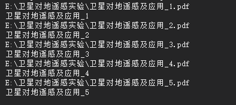

# 气溶胶数据处理软件流程

## 要求

读取 CSV 格式数据，数据的文件可以是一个或者多个，如果是多个，则需要一起导入进行处理。

在这个过程中，需要解决的问题是：

1. 完成文件的拼接；
2. 在文件上面加上文件名限制，作为日期数据导入参与计算；
   需要解析多文件
   多文件文件名名转化为各自的日期带入计算
3. 计算过程需要引入一些特殊的数学函数，要看一下有没有现成的轮子用；
4. 计算完成数据之后结果进行画图输出（记得是有一个控件可以完成这个功能的）。

## 读取 CSV 数据

读取 CSV 数据使用开源的 CsvHelper 组件进行，读取方式是字符串匹配得到属性值。

但是需要注意的是：读取的时候，CSV 文件需要是使用 UTF-8 编码，且头部无任何其他的东西。(e.g. 也就是如果你用 Microsoft 的记事本打开之后，这个再读取是会出错的，需要用 Notepad++ 重新打开转化为 UTF-8 编码😭，在这个读取上面就花了一下午时间研究为什么读不进)。

## 文件名处理

### 解析单个文件路径

单个文件路径的解析可以通过调用 `System.IO` 下面的 `Path` 类下面定义的一系列静态方法解决。

`Path` 类包含可以用于解析某个给定路径的方法。与编写路径解析和文件名解析的代码相比，使用这些类要更加简单并且不容易出错。如果不使用这些类，在安全决策中手动解析例程，也有可能会给软件带来安全漏洞，用于解析的主要是五个方法。

- GetPathRoot
  该方法返回路径的根目录。如果路径中没有根目录，例如使用一个相对路径时，该方法返回一个空字符串，而不是 null
- GetDirectoryName
  该方法返回文件所在目录的完整路径
- GetFileName
  该方法返回文件名，包含文件的扩展名。如果路径中没有提供文件名，那么该方法返回一个空字符串，而不是 null
- GetExtension
  该方法返回文件的扩展名。如果没有提供文件的扩展名或者路径中没有文件，那么其返回一个空字符串，而不是 null
- GetFileNameWithoutExtension
  都不用讲了看名字就知道了

要注意，这些方法并不能确定驱动器、目录甚至文件是否存在或者运行于系统中。这些方法仅仅是字符串解析器，只要传递正确的字符串，就能解析出对应的文本。

### 参考

[详情见 MSDN 的 `System.IO.Path` 类下的说明。](https://docs.microsoft.com/zh-cn/dotnet/api/system.io.path?view=netframework-4.7.2)

### 解析多个文件路径

多个文件路径的解析是通过 `openFileDialog` 完成的。看代码

```csharp
//初始化 openFileDialog 类实例化对象 testDialog 
//使用 using 可以自动销毁对象
using (openFileDialog testDialog = new openFileDialog())
{
    //设置文全部文件格式都可以选择
    testDialog.Filter = "All Files (*.*)|*.*";
    //决定 Filter 决定的顺序从哪里开始，默认是1
    testDialog.FilterIndex = 1;
    //可以选择多个文件
    testDialog.Multiselect = true;

    if(testDialog.ShowDialog() == DiaologResult.OK)
    {
        string[] arrAllFiles = testDialog.FileNames;
    }
    else
    {
        arrAllFiles = string.empty;
    }
}
```

上面的代码可以得到多个文件的路径主要的作用语句就是。

```csharp
string[] arrAllFiles = terstDialog,FileNames;
```

FilterIndex  也就指的是下面这个东西。


读取结果也就是像这样，当然这个结果是需要用 `Path` 作解析之后得到的



## 文件的拼接

### 日期的获取

从前面的路径中可以解析出一串带有日期的字符串，就像 “20180807” 这样的，解析出来的字符串要转化为日期格式的数据，应该通过下列语句

```csharp
string date = "20090508";
DateTime myDate = DateTime.ParseExact(date, "yyyyMMdd",
	System.Globalization.CultureInfo.InvariantCulture);
```

其中，字符串 `date` 可以通过先前的路径解析得到，然后按照格式要求得到相应的日期时间格式的数据。

```csharp
string time = "18:00:45";
DateTime myTime = DateTime.ParseExact(time, "HH:mm:ss",
	System.Globalization.CultureInfo.InvariantCulture);
```

时间的获取跟之前的日期获取一样。

之后，需要把他们连接起来，取 `myDate` 的日期和 `myTime` 的时间。

```csharp
DateTime myDateTime = new DateTime();
myDateTime = myDate.Date.Add(myTime.TimeOfDay);
Console.WriteLine("after:\t"+myDateTime);
```

这里新建了一个 `myDateTime` 的对象来存储得到的日期数据。最后处理完大概是这样的结果


## 在 WinForm 内实现文件拼接和日期连接

#### 窗口布局和数据读取结果


#### 处理代码

`openFileDialog1.ShowDialog()` 的方法，此方法是由 `openFileDialog` 继承自 `FileDialog` ，`FileDialog` 继承自 `CommonDialog` 的一个方法。，返回的是 `DialogResult` 方法，如果用户在对话框中单击“确定”，则为 [OK](https://docs.microsoft.com/zh-cn/dotnet/api/system.windows.forms.dialogresult?view=netframework-4.7.2#System_Windows_Forms_DialogResult_OK)；否则为 [Cancel](https://docs.microsoft.com/zh-cn/dotnet/api/system.windows.forms.dialogresult?view=netframework-4.7.2#System_Windows_Forms_DialogResult_Cancel)。

[参考自 MSDN 的 CommonDialog 方法。](https://docs.microsoft.com/zh-cn/dotnet/api/system.windows.forms.commondialog.showdialog?view=netframework-4.7.2)

`arrAllFiles` 直接可以通过 `openDialog` 的 `FileNames` 属性得到，注意不要忘记 `s`。

之后设置列的名字 `setColumName` ，这个是自定义类的一个方法。

然后就是数据流读取数据，处理读入的文件名和时间信息，将其转化为日期格式数据。 `DateTime` 类的 `Date` 实例是读取的文件名转化为时间数据格式的数据，格式是 “yyyyMMdd”。这个转换的来源是从前一条语句的通过 `Path` 类下面的静态方法  `GetFileNameWithoutExtension` 得到的 `FileName`。

之后就连接 CSV 文件进行读取，得到第一列时间数据，转化为 `TimeSpan` （作为两个时间格式数据之间的差值），这里会记录的间隔也就是时间。`Date.Date.Add()` 接收的值的格式为 `TimeSpan` ，返回的是一个对象，其值是此实例所表示的日期和时间与 `value` 所表示的时间间隔之和。也就是日期和时间连接的功能实现了。

至此，也就完成了时间日期读取连接工作。

```csharp
//打开文件
if (openFileDialog1.ShowDialog() == DialogResult.OK)
{
    string[] arrAllFiles = openFileDialog1.FileNames;
    foreach (var file in arrAllFiles)
    {

        //读入数据
        DataTable.setColumName(dataGridView1);
        using (var reader = new StreamReader(file))
            using (var csv = new CsvReader(reader))
        {
            string FileName = Path.GetFileNameWithoutExtension(file);
            DateTime Date = DateTime.ParseExact(FileName, "yyyyMMdd", 
             System.Globalization.CultureInfo.InvariantCulture);
            csv.Configuration.RegisterClassMap<DataTableMap>();
            var records = csv.GetRecords<DataTable>();            
            ///读取数据                     
            foreach (var record in records)
            {
                var Time = TimeSpan.Parse(record.Time);
                var myDateTime = Date.Date.Add(Time);
                dataGridView1.Rows.Add(myDateTime, record.Channel1, 
                 record.Channel2,record.Channel3, record.Channel4, 
                 record.Channel5,record.Channel6, record.Channel7, 
                 record.Channel8,record.ConTem, record.CPUTem, 
                 record.EnvTem, record.EnvWet,reecord.AirPre);
            }
        }
    }
}
```


## 数值计算

需要把读取进来的数据进行一些数学处理得到相应的结果，其中的重难点是进行一些特殊的数学运算。

要写一个关于数据处理的类，将数据与方法封装到类中。

今天又突然想到一个其他的实现的方法，其实可以写一个软件，把所有的 CSV 数据都读到数据库里面，之后再通过一个数据处理的软件进行数据读取和处理。

<!--DateTime:2019/3/30	15:39:00-->

### CSV 文件读取

今天完成了大气质量的计算，并且对照之前在 MATLAB 上面的程序验证通过，但是输入的数据都是一个个的，封装成了类。所以如何把读入的数据按照一行一行的读入到类中，使用类的函数批处理这些数据也是个问题，现在想到的方法是将其用数组的形式存入属性中，再使用矩阵计算(不知道 C# 中有没有)，再得出处理好的数据进行画图和导出。

### CSV 数据读入和计算

先看一下定义的类和属性就明白怎么写的了。

```csharp
class AeroOpticalDepth
    {
    //仅仅是属性的定义
        public static double[] DN0 = new double[] { 63484, 68577, 61448, 57414, 64450, 61584, 92456, 56643 };//定标系数(可以进行修改)
        //public DateTime[] myDateTime; //时间
        public List<DateTime> myDateTime = new List<DateTime>();
        public List<double> D_D0;         //日地修正因子
        //public double UT;           //通用时间(Universal Time),h/h
        //public double deltaTTUT;    //TT-UT,deltat/s
        public double Lonitude;     //经度,theta/rad,[0,2*pi]
        public double Latitude;     //纬度,phi/rad,[-pi/2,pi/2]
        public List<double> Pressure;     //气压,P/atm
        public List<double> Temperature;  //气温,T/℃
        public List<double> RightAscension;//赤经,alpha/rad,[0,2*pi]
        public List<double> Declination;  //赤纬,delta/rad,[-pi/2,pi/2]
        public List<double> HourAngle;    //时角,H/rad,[-pi,pi]
        public List<double> Zenith;       //天顶角,z/rad,[0,pi]
        public List<double> Azimuth;      //方位角,gamma/rad,[-pi,pi]
        public List<double> AirMass;      //大气质量
        //public double Taug;         //吸收气体透过率，这个二不用考虑
        public List<double> Tautot;       //总的光学厚度
        public List<double> Taur;         //瑞利散射光学厚度
        public List<double> Tauaero;        //气溶胶光学厚度
}
```

在这里写了一个 `AeroOpticalDepth` 的类来完成这个计算，因为 CSV 读入的都是数组类型的数据，在这里定义其属性为 [`List<>`](https://docs.microsoft.com/en-us/dotnet/api/system.collections.generic.list-1?view=netframework-4.7.2) 类型，使用这种数据结构的好处是有许多现成的增减方法供直接调用。

再导入了 CSV 的读取数组之后将数据传递到 `List<>` 数据类型的变量中，并且封装在对象中，使用 `foreach` 或者 `for` 循环进行取出计算，在使用 `for` 的时候，次数可以使用 `List<>` 类型的 `Count` 属性获得，实际上这也是一种类，它的构造函数可以由下面这样得到

```csharp
List<double> zenith = new List<double>();
```

### 调试

- 调试其实花了绝大部分的时间，首先，C# 的数据类型是十分严格的，要知道每个表达式你要得到的是 `int` 还是 `double` ，在计算 `t` 的时候，我把 `DateTime` 里面的 `Hour` 就直接 ➗ 24，其实这个是个整形的数，所以结果还是整形，得不到正确的结果，在计算前面，需要进行强制类型转化。

- 另一个就是取余的问题，在 MATLAB 里面，取余(取模)是有两个函数的 `mod` 和 `rem` ，`mod` 的余数的符号与除数相同，`rem` 余数的符号与被除数相同。在 C# 里面，使用的是 `%`，余数的符号与被除数的符号相同，其实在这里需要的是与除数符号相同的余数，其实也不难，只需要判断一下，是否这个余数还是小于 0，如果还是小的话，那就加上一个除数，就变成正数了。

  ```csharp
  double rem(double a,double b)
  {
      double c = a%b;
      if(c<0){c=c+b;}
      return c;
  }
  ```

<--DateTime  2019/4/18 23:17:26-->

今天还是比较开心的，花了一下午搞完了这个计算问题，虽然前面有 MATLAB 版本的计算，明天后天专注于将数据可视化即可😋

### 数据写入数据库

- 使用 `MySQL` 数据库进行读写数据；
- 写数据库模块；
- 读数据库模块；
- 处理数据模块；
- 显示数据模块（画图）。

## 绘图输出结果

